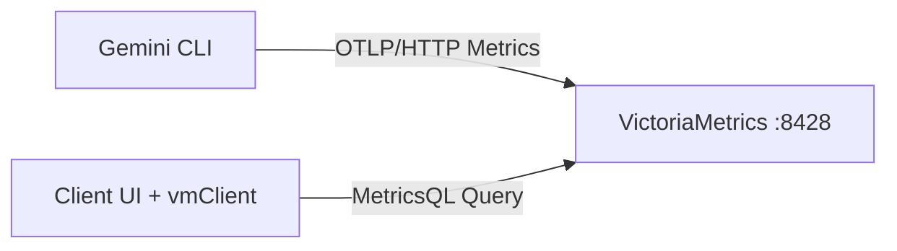

# Aiden 本地集成版系统设计方案 (Direct-to-VM)

## 1. 设计目标 (Architecture Goals)

本方案面向 Gemini CLI Telemetry 监控场景，采用最小链路的本地化架构，目标是低复杂度、可快速落地、可稳定运行。

- **最小依赖**: 仅保留 VictoriaMetrics 作为指标存储与查询后端。
- **直连上报**: Gemini CLI 直接通过 OTLP/HTTP 上报到 VictoriaMetrics。
- **一致体验**: 围绕 Token、成本、上下文占用与激活统计提供统一监控能力。
- **可演进**: 未来可按需扩展采集或处理层，但不作为当前设计前提。

---

## 2. 范围定义 (Scope)

### 2.1 本期范围
- Gemini CLI telemetry 接入与配置。
- VictoriaMetrics 指标存储与查询。
- 监控面板所需的指标聚合与状态判定。
- 首次引导中的配置检测与自动配置。

### 2.2 非本期范围
- 日志链路（VictoriaLogs / LogQL / 终端日志）。
- Trace 可视化链路（Jaeger / ThoughtStream 追踪实现细节）。
- OTel Collector 作为中间采集层。

---

## 3. 总体架构 (High-Level Architecture)

### 3.1 数据流


### 3.2 架构说明
- 上报链路: `Gemini CLI -> VictoriaMetrics`
- 查询链路: `Client UI/vmClient -> VictoriaMetrics`
- 系统健康: 以 VictoriaMetrics 查询可用性与上报链路可用性作为判定基础。

---

## 4. 组件设计 (Component Design)

| 组件 | 职责 | 关键约束 |
|------|------|----------|
| Gemini CLI | 产生并上报 telemetry metrics | 必须启用 telemetry，协议固定 OTLP/HTTP |
| VictoriaMetrics | 指标写入、存储、聚合与查询 | 对外提供 OTLP 接收与 MetricsQL 查询能力 |
| vmClient | 统一查询封装与错误处理 | 查询必须并发执行，避免串行阻塞 |
| Client UI | 指标展示、状态反馈、引导流程 | 不绑定特定前端框架实现 |

---

## 5. 配置规范 (Telemetry Configuration)

Gemini CLI 配置文件: `~/.gemini/settings.json`

默认配置（本期标准）：

```json
{
  "telemetry": {
    "enabled": true,
    "useCollector": false,
    "otlpProtocol": "http",
    "otlpEndpoint": "http://127.0.0.1:8428/opentelemetry"
  }
}
```

配置约束：
- `enabled` 必须为 `true`。
- `useCollector` 固定为 `false`。
- `otlpProtocol` 固定为 `http`。
- `otlpEndpoint` 必须指向 `http://127.0.0.1:8428/opentelemetry`。

说明：客户端上报路径按 OTLP 规范使用 `/v1/metrics`。

---

## 6. 关键流程 (Key Flows)

### 6.1 首次引导与配置校验
1. 检测本地状态标记 `aiden_onboarded`。
2. 检测 `gemini` CLI 是否可用。
3. 校验 telemetry 配置完整性（enabled/useCollector/otlpProtocol/otlpEndpoint）。
4. 若不符合标准，自动修正为默认配置。
5. 标记引导完成并进入监控主界面。

### 6.2 健康检查
- 检测 VictoriaMetrics 端点可访问性。
- 检测查询接口返回有效结果。
- 满足上述条件判定 `Online`，否则 `Offline`。

### 6.3 指标查询与聚合
- 所有指标查询采用并发模式执行。
- 时间戳首条数据定位使用 `tfirst_over_time`。
- 结果在查询层完成结构化后再提供给展示层。

---

## 7. 查询接口与指标口径 (Query & Metrics Conventions)

### 7.1 查询接口
- VictoriaMetrics 查询接口: `GET /api/v1/query`

### 7.2 指标口径
- Token 统计: Input/Output 累计值。
- 成本估算: 基于 Token 权重实时换算。
- Context Window: 统一显示为 `M` 单位。
- Active Days: 由首条遥测时间计算。

---

## 8. 性能与可靠性 (Performance & Reliability)

- 禁止串行 `await` 进行多指标请求。
- 查询超时与错误必须在 vmClient 统一处理。
- UI 动画仅做展示，不阻塞数据刷新。
- 手动刷新触发全量重查，保证可恢复性。

---

## 9. 运行要求 (Runtime Requirements)

- 本地需可访问 `127.0.0.1:8428`。
- 配置文件 `~/.gemini/settings.json` 需具备读写权限。
- 需确保 VictoriaMetrics 已启动且可写入 OTLP metrics。

---

## 10. 演进方向 (Roadmap)

1. 完成直连链路稳定性优化（重试、错误分级、诊断信息）。
2. 增强指标体系（会话维度、模型维度、时间窗口对比）。
3. 增加离线诊断导出能力（本地报告）。
4. 评估后续可选扩展（如采集中间层），但不影响当前直连架构。
