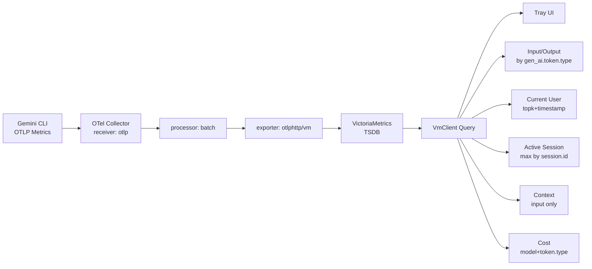
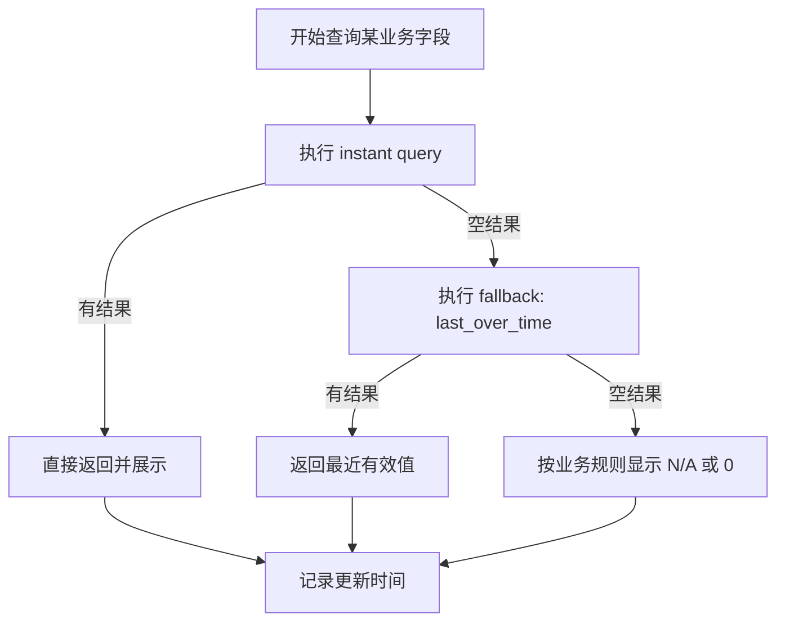
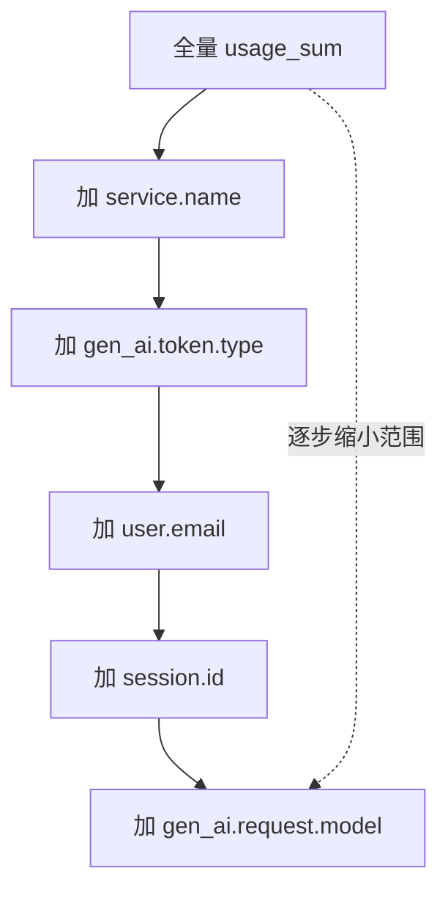

> 前置阅读：
> - `docs/产品需求-FRD.md`
> - `docs/功能规格-FSD.md`
> - `docs/技术设计-TDD.md`
> - `docs/自动化测试-ATD.md`
>
> 适用场景：当你需要分析指标口径、排查查询结果与原始上报差异时阅读本专题。
# 指标与标签深度讲解：Gemini CLI 原生上报 vs VM 查询视角

## 学习地图（先看这里）

你可以按三条路线阅读：

### 路线 A：入门线（先建立正确直觉）
1. [先分清两个核心概念](#1-先分清两个核心概念)
2. [Gemini 原生上报数据长什么样](#2-gemini-原生上报数据长什么样)
3. [为什么 VM 查询看到的像另一种数据](#3-为什么-vm-查询看到的像另一种数据)
4. [哪里变了哪里没变](#4-哪里变了哪里没变关键对照)

目标：不再把“查询结果”误当成“原始上报值”。

### 路线 B：进阶线（形成查询设计能力）
1. [为什么值看起来不一样](#5-为什么值看起来不一样)
2. [具体样例从原生到查询](#6-具体样例从原生到查询)
3. [同一条样本的逐帧变化表](#10-同一条样本的逐帧变化表otlp---vm---查询结果)
4. [快速实操清单](#12-快速实操清单你可以直接照做)

目标：能自己写出稳定口径查询，不依赖现成模板。

### 路线 C：排障线（遇到问题直接定位）
1. [常见误区](#7-常见误区必须避免)
2. [最小判断准则](#8-最小判断准则实战)
3. [五个真实排障案例](#11-五个真实排障案例症状---检查---结论)
4. [快速实操清单](#12-快速实操清单你可以直接照做)

目标：快速区分“无数据”“口径错”“瞬时空值”“过滤过严”。

---

## 推荐阅读顺序（线性版）

如果你希望系统吃透，按下面顺序读：

1. 第 1-4 节：建立数据模型与变化边界
2. 第 5-6 节：把查询语义与业务语义对齐
3. 第 7-8 节：掌握误区与判断规则
4. 第 10 节：逐帧回放（形成稳定心智模型）
5. 第 11-12 节：转入实战排障
6. 第 13 节：进入下一篇（log->metrics 专题）

---
## 1. 先分清两个核心概念

### 1.1 指标（Metric）
指标是“你在统计什么”的名称。  
在当前链路中，核心指标是：

- `gen_ai.client.token.usage_sum`

它表示 token usage 的累计型指标（语义由指标规范与上报端决定）。

### 1.2 标签（Label / Attributes）
标签是“这个指标属于哪个维度”的信息，用来切分、过滤、聚合。  
常见标签：

- `service.name`
- `gen_ai.token.type`
- `user.email`
- `session.id`
- `gen_ai.request.model`

**结论**：  
- 指标名决定统计对象  
- 标签决定统计维度

---

## 2. Gemini 原生上报数据长什么样

Gemini CLI 原生上报采用 OTLP 数据模型，是分层结构，不是扁平文本：

1. Resource（资源级属性）
2. Scope（埋点库/仪表库信息）
3. Metric（指标定义）
4. DataPoint（样本点与 datapoint 属性）

典型理解：
- `service.name/user/session/model` 常在 resource 层
- `gen_ai.token.type` 常在 datapoint 层
- 值在 datapoint 层（例如 usage 数值）

---

## 3. 为什么 VM 查询看到的像“另一种数据”
到了 VictoriaMetrics，查询时看到的是“时序标签模型”：

- 一条时序 = `metric_name + labels`
- 然后按时间轴取样本值

这会让你感觉“原生数据被改了”，但本质是：

- 不是业务语义改写
- 是从 OTLP 分层对象映射到时序查询抽象

---

## 4. 哪里变了，哪里没变（关键对照）

### 4.1 没变的部分（Gemini 路径）
- 核心指标名保持：`gen_ai.client.token.usage_sum`
- token type 语义保持：`input/output`
- service/user/session/model 维度语义保持

### 4.2 变了的部分
1. **表示形式变了**：OTLP 分层 -> VM 标签时序  
2. **时效表现变了**：batch 导致可见性延迟  
3. **展示值变了**：查询聚合（`sum/topk/last_over_time`）导致“看到的值”不同于单点原始值

---

## 5. 为什么“值看起来不一样”
大部分情况不是“上报值被改”，而是“查询口径在变”：

1. `sum(...)`  
- 把多条时序合并成一个值

2. `last_over_time(...[Nd])`  
- 当前没点时取窗口内最后一个值

3. `topk + timestamp`  
- 从多个 user/session 中选“最近活跃”的那条

所以 UI 的数值通常是“业务计算结果”，不是原始单条 datapoint 直读。

---

## 6. 具体样例（从原生到查询）

假设 Gemini 上报一个 input token 点（示意）：

- metric: `gen_ai.client.token.usage_sum`
- resource attrs:
  - `service.name=gemini-cli`
  - `user.email=a@x.com`
  - `session.id=s1`
  - `gen_ai.request.model=gemini-2.5-flash`
- datapoint attrs:
  - `gen_ai.token.type=input`
- value: `120`

在 VM 查询时可命中的形式：

```promql
gen_ai.client.token.usage_sum{
  service.name="gemini-cli",
  user.email="a@x.com",
  session.id="s1",
  gen_ai.request.model="gemini-2.5-flash",
  gen_ai.token.type="input"
}
```

语义没变，查询视图变了。

---

## 7. 常见误区（必须避免）

1. 把 `usage_sum` 当作天然 total  
- 错误。是否 total 由 `gen_ai.token.type` 过滤决定。

2. instant 查询空就判定“没上报”  
- 错误。可能只是当前时刻无点，需 `last_over_time`。

3. 看到 VM 标签平铺就以为上游字段改写了  
- 错误。多数是模型映射，不是语义改写。

4. 一次性加太多过滤条件  
- 容易把结果筛空，误判链路故障。

---

## 8. 最小判断准则（实战）
每次看指标先问四件事：

1. 我查的是哪个指标名？  
2. 我是否明确限定了 `service.name`？  
3. 我是否明确限定了 `gen_ai.token.type`？  
4. 当前语义该用 instant 还是 `last_over_time`？

---

## 9. 一句话总结
Gemini 指标链路里，真正变化主要是“数据表示与查询口径”，  
不是“核心业务语义被改写”。

## 10. 同一条样本的逐帧变化表（OTLP -> VM -> 查询结果）

下面用一条示例样本演示“同一份事实数据”在链路中的表现。

### 10.1 示例原始事实
- metric: `gen_ai.client.token.usage_sum`
- service: `gemini-cli`
- user: `alice@example.com`
- session: `sess-001`
- model: `gemini-2.5-flash`
- token.type: `input`
- value: `120`

### 10.2 逐帧对照

| 阶段 | 数据形态 | 关键字段/值 | 变化类型 | 为什么会这样 |
|---|---|---|---|---|
| Gemini CLI 上报 | OTLP 层级对象 | metric=`gen_ai.client.token.usage_sum`; resource attrs + datapoint attrs; value=120 | 原始事实 | 上报端产生业务语义 |
| Collector 接收 | Collector 内部 OTLP 对象 | 字段语义保持不变 | 协议解码 | 网络 payload 进入处理引擎 |
| Collector batch | 批量对象 | 同值同标签，发送时机延后 | 时效变化 | 批处理提高吞吐 |
| VM 落库 | 时序模型 | series=`metric+labels`; sample value=120 | 存储映射 | VM 用标签索引时序 |
| PromQL instant | 查询结果向量 | 若当前时刻无样本 -> 空 | 查询视角变化 | instant 只看“当前点” |
| PromQL last_over_time | 查询结果向量 | 返回窗口内最后样本 -> 120 | 查询口径变化 | 提升可用性，避免误判空值 |
| UI 展示（Input） | 业务值 | `sum(...type=input...)` -> 120 | 聚合口径 | 面板展示按业务口径聚合 |

### 10.3 再给一条 output 例子
若同一 session 再上报一条：
- token.type=`output`
- value=`35`

则常见查询结果：
- Input 查询：120
- Output 查询：35
- 不加 token.type 的 sum：155（input+output）

> 这就是为什么“是否过滤 `gen_ai.token.type`”会直接改变业务口径。

---

## 11. 五个真实排障案例（症状 -> 检查 -> 结论）

### 案例 1：面板 Input/Output 显示 0，但你确定 CLI 在跑
**症状**：页面 0，状态在线。

**先查**：
```promql
sum by (service.name, gen_ai.token.type) (
  last_over_time(gen_ai.client.token.usage_sum[1d])
)
```

**结论分支**：
- 有 `gemini-cli` 数据：UI 过滤条件过严（多半是 user/session 维度筛空）
- 只有其它 service 数据：页签/`service.name` 过滤不一致
- 完全无数据：上报端或 collector 接收链路问题

---

### 案例 2：instant 查询为空，fallback 才有值
**症状**：瞬时查询空，但 fallback 有数。

**解释**：
- 不是故障，是时序采样特性。
- 当前时刻没有点，但窗口内有最近样本。

**建议**：
- 面板类场景保留 instant + fallback 设计。

---

### 案例 3：Context 看起来异常偏大
**症状**：Context 百分比过高。

**高概率原因**：
- 查询口径没有限定 `gen_ai.token.type="input"`，把 output 也算进去了。

**核对口径**：
```promql
sum(gen_ai.client.token.usage_sum{...,gen_ai.token.type="input"})
```

---

### 案例 4：Current User 偶发变成 Unknown
**症状**：偶发 Unknown，但过一会恢复。

**常见原因**：
- instant 时刻 user 相关序列无点，fallback 窗口设置过小。

**检查建议**：
```promql
topk(1, max by (user.email) (
  timestamp(last_over_time(gen_ai.client.token.usage_sum{service.name="gemini-cli",user.email!=""}[7d]))
))
```

---

### 案例 5：Cost 突然异常（过高或过低）
**症状**：费用与体感不符。

**排查顺序**：
1. 是否按 `model + token.type` 聚合后再乘费率
2. 模型名是否命中费率表
3. 未命中是否走了默认费率

**最小核对查询**：
```promql
sum by (gen_ai.request.model, gen_ai.token.type) (
  last_over_time(gen_ai.client.token.usage_sum{service.name="gemini-cli"}[1d])
)
```

---

## 12. 快速实操清单（你可以直接照做）

1. 看全局是否有 usage 指标：
```promql
sum by (service.name, gen_ai.token.type) (last_over_time(gen_ai.client.token.usage_sum[1d]))
```
2. 锁定 Gemini：
```promql
sum by (gen_ai.token.type) (last_over_time(gen_ai.client.token.usage_sum{service.name="gemini-cli"}[1d]))
```
3. 锁定用户：
```promql
sum by (gen_ai.token.type) (last_over_time(gen_ai.client.token.usage_sum{service.name="gemini-cli",user.email="alice@example.com"}[1d]))
```
4. 锁定会话：
```promql
sum by (gen_ai.token.type) (last_over_time(gen_ai.client.token.usage_sum{service.name="gemini-cli",user.email="alice@example.com",session.id="sess-001"}[1d]))
```
5. 校验 Context 口径（input only）：
```promql
sum(last_over_time(gen_ai.client.token.usage_sum{service.name="gemini-cli",user.email="alice@example.com",session.id="sess-001",gen_ai.token.type="input"}[1d]))
```

---

## 13. 本文与下一篇的边界
本文重点：Gemini 原生 metrics 直通链路。  
下一篇重点：Codex 的 log -> metrics 转换机制与为什么要做 `deltatocumulative + metricstarttime`。


## 一图流（Gemini Metrics 从上报到展示）

### 图 1：全链路流程图



### 图 2：查询决策流程（instant + fallback）



### 图 3：从宽到严的过滤收敛



---

## 图后解读（你应重点记住）

1. Gemini 路径没有 log->metric 转换，主路径是 metrics 直通。  
2. 大部分“值变化”发生在查询层（聚合与回退），不是上报值被改写。  
3. 排障时一定按“从宽到严”收敛过滤，否则很容易把自己筛空。  
4. `Context` 是业务口径字段，不等同于所有 token 类型总和。

---

## 14. 过渡篇：为什么 Codex 需要 Log -> Metrics（而 Gemini 不需要）

你现在可以把两条链路并排理解：

1. Gemini：原生上报的是 OTLP Metrics，所以 Collector 主要做转发与少量处理。  
2. Codex：原生上报的是 OTLP Logs（事件流），而 VM 看板主要消费 Metrics，所以必须先把日志转换为指标。  

核心差异不是“谁更先进”，而是“原始信号类型不同”：

1. Metrics 天生适合聚合和时序查询。  
2. Logs 天生适合事件审计与上下文追踪。  
3. 当你希望在统一看板里展示 token 曲线、按 user/session/model 聚合时，logs 需要先变成 metrics。  

---

## 15. Log -> Metrics 的最小心智模型

把它理解成 3 步：

1. 取数：从日志里提取可计量字段（例如 `usage`）。  
2. 映射：决定 metric 名称、数值字段、标签维度（如 `service.name/user.email/session.id/gen_ai.token.type/model`）。  
3. 语义修正：让指标在时序库里可稳定累计、可被 `sum`/`rate` 正确解释。  

常见新手误区：  
“日志里有 usage，为什么 VM 看不到 token 曲线？”  
答案通常是：链路的某一段没产出“可累计、可查询的指标语义”。

---

## 16. 为什么常见需要 `deltatocumulative + metricstarttime`

你之前问过这个点，这里给一个统一解释。

`deltatocumulative` 作用：
1. 把“每条日志事件里的增量值”转换为“累积时序”更易查询的形态。  
2. 避免某些后端在聚合时把离散增量当瞬时样本，导致图上抖动或误读。  

`metricstarttime` 作用：
1. 补齐/稳定 StartTime，减少后端对累计序列重置点的误判。  
2. 在重启、会话切换、collector 重载后，让累计语义更一致。  

为什么 Gemini 常不需要这两个：
1. 因为 Gemini 入口就是“规范化 metrics”，不是从 logs 现转。  
2. 它的时间语义和聚合语义在源头就更稳定。  

---

## 17. 从数据变化角度看 Codex 与 Gemini 的不同

### Gemini（原生 metrics）
1. 主要变化在查询层：窗口、聚合、过滤。  
2. 原始值语义通常保持稳定。  

### Codex（log -> metrics）
1. 先发生“信号类型变化”：log event -> metric sample。  
2. 再发生“语义规范化”：delta -> cumulative、start time 对齐。  
3. 最后才是查询层变化：聚合、过滤、fallback。  

这就是你看到“同样叫 usage_sum，链路行为却不完全一样”的根本原因。

---

## 18. 最小排障路径（专治：收到日志但没有 VM 指标）

按这 6 步，不要跳步：

1. 验证 collector 确实收到 Codex logs（receiver 侧 debug）。  
2. 在 `logs -> metrics` 转换节点后加 debug exporter，确认是否产出 metrics。  
3. 确认 metrics pipeline 是否经过 `deltatocumulative` 与 `metricstarttime`（如配置要求）。  
4. 确认 exporter 已把该指标写到 VM（看 exporter 成功计数/错误计数）。  
5. 在 VM 先用最宽查询看是否存在该 metric 名称。  
6. 再按 `service.name -> token.type -> user.email -> session.id -> model` 逐层收敛。  

---

## 19. 查询口径统一建议（Gemini 与 Codex 对齐）

如果你的目标是“除了 service.name 不同，其余看板逻辑尽量一致”，建议：

1. 统一 metric 名称（例如都落在 `gen_ai.client.token.usage_sum`）。  
2. 统一关键标签名（`service.name/user.email/session.id/gen_ai.request.model/gen_ai.token.type`）。  
3. 统一 Context 口径：`input` only。  
4. 统一 fallback 策略：instant 空则 `last_over_time`。  

这样你在 UI 侧基本可复用同一套查询模板。

---

## 20. 你已经可以“精通级”掌握的检查清单

当你看到“数字不对/没数据/延迟”时，先判断属于哪一层：

1. 上报层问题：CLI 没发或字段缺失。  
2. 采集层问题：Collector 没收到或丢弃。  
3. 转换层问题：logs 没变成 metrics，或语义没修正。  
4. 存储层问题：VM 没写入或被限流。  
5. 查询层问题：标签过滤过严、窗口不对、聚合口径错误。  

把问题先归层，再动手排查，效率会提升很多。

---

## 21. 查询模板库（可直接复制）

### 21.1 先看 metric 是否存在（最宽）
```promql
sum(last_over_time(gen_ai.client.token.usage_sum[1d]))
```

### 21.2 按服务看（Gemini/Codex）
```promql
sum by (service.name) (
  last_over_time(gen_ai.client.token.usage_sum[1d])
)
```

### 21.3 按 token.type 分解
```promql
sum by (service.name, gen_ai.token.type) (
  last_over_time(gen_ai.client.token.usage_sum[1d])
)
```

### 21.4 看单用户总消耗
```promql
sum by (user.email) (
  last_over_time(gen_ai.client.token.usage_sum{service.name="gemini-cli"}[1d])
)
```

### 21.5 看单会话 Context（input only）
```promql
sum(
  last_over_time(
    gen_ai.client.token.usage_sum{
      service.name="gemini-cli",
      user.email="alice@example.com",
      session.id="sess-001",
      gen_ai.token.type="input"
    }[1d]
  )
)
```

### 21.6 当前活跃会话（最近有点）
```promql
topk(
  1,
  max by (session.id) (
    timestamp(last_over_time(gen_ai.client.token.usage_sum{service.name="gemini-cli",session.id!=""}[7d]))
  )
)
```

### 21.7 模型成本基线输入（按模型与类型）
```promql
sum by (gen_ai.request.model, gen_ai.token.type) (
  last_over_time(gen_ai.client.token.usage_sum{service.name="gemini-cli"}[1d])
)
```

